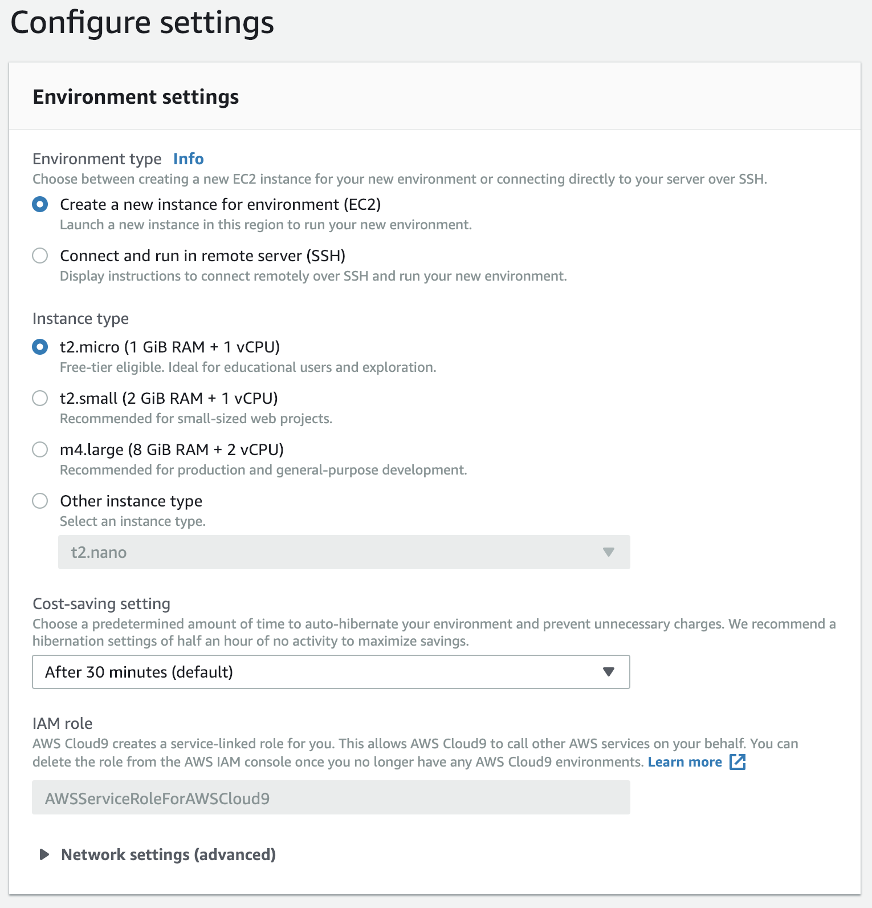
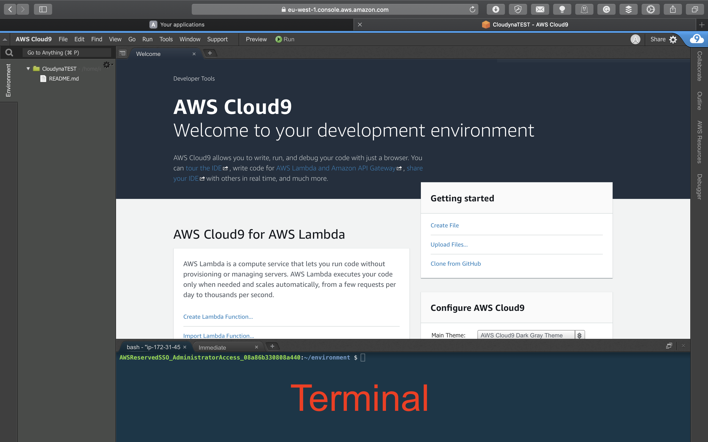

<br><br>
<br><br>
<br><br>

# LAB 1 - Creating Cloud9 Environment, ECR repositories. Cloning solution.

## LAB Overview

#### This lab will demonstrate:
 * Prepating Cloud9 development environment
 * Creating ECR repositories

## Task 1. Prepare Cloud9 environment

In this task you will prepare Cloud9 devevlopment environment to work on our project.

1. In the AWS Management Console, on the **Services** menu, click **Cloud9**.
2. Click **Create environment**.
3. Enter a name for your environment, e.g. "Cloudyna2019".
4. Click **Next step**.
5. As "Environment type" select *Create a new instance for environment (EC2)*.
6. Select *t2.micro* as "Instance type".

7. In **Platform** make sure **Amazon Linux** is selected.
8. Click **Next step**.
9. Review your environment and click **Create environment**.

Wait for your environment, and when it's ready..

## Task 2. Cloning solution repo
In this taks you will use cloud9 terminal to clone a repository into your IDE.

1. In your Cloud9 environment terminal, create a directory for the solution by:
```
mkdir app
```
end enter it
```
cd app
```
2. Clone the repository by executing:
```
git clone https://github.com/cloudstateu/cloudyna19aws
```

## Task 3. Creating Amazon Elastic Container Registry repositories

Please, replace X (whenever appeares) with your student number.

1. Still in the Cloud9 terminal console execute following commands
```
aws ecr create-repository --repository-name cloudyna/backend-X
```

```
aws ecr create-repository --repository-name cloudyna/frontend-X
```

and create a registry for both backend and frontend docker images.

You should get resoponses similiar to:
```json
{
    "repository": {
        "repositoryUri": "325549929834.dkr.ecr.eu-west-1.amazonaws.com/cloudyna/frontend-1", 
        "registryId": "325549929834", 
        "imageTagMutability": "MUTABLE", 
        "repositoryArn": "arn:aws:ecr:eu-west-1:325549929834:repository/cloudyna/frontend-1", 
        "repositoryName": "cloudyna/frontend-1", 
        "createdAt": 1572350177.0
    }
}
```


## END LAB

<br><br>

<center><p>&copy; 2019 Chmurowisko Sp. z o.o.<p></center>
