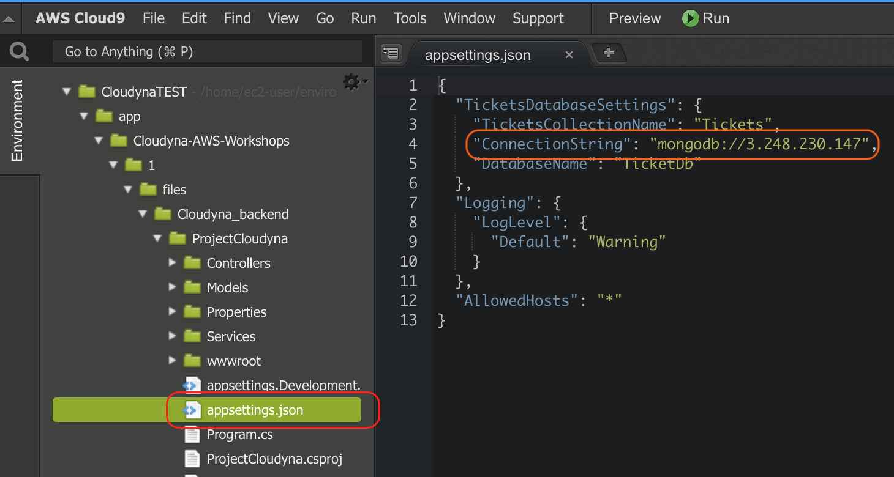
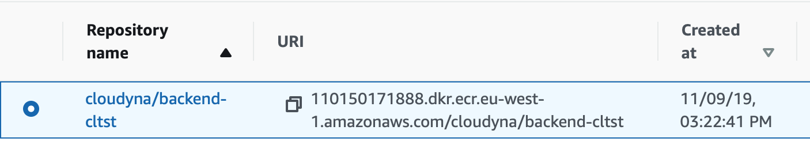

<br><br>
<br><br>
<br><br>

# Preparing docker images

## LAB Overview

## Task 1: Creating Docker images

1. In your Cloud9 environment's find *Cloudyna_backend/ProjectCloudyna/appsettings.json* file and open it.

2. Replace *YOUR-MONGO-CONNECTION-STRING* with the IP address provided by the instructor.
3. Save the file.
4. In your Cloud9 environment's terminal go into *Cloudyna_backend* directory.

```shell
~/environment/app $ cd Cloudyna-AWS-Workshops/1/files/Cloudyna_backend/
```

5. In the AWS Management Console, on the **Services** menu, click **ECR**.
Find your **backend** repository and select it

6. Click **View push commands**.

Description below is only sample. Please use exact commands copied from the window you see in your console.

7. You need to login. Copy first command from the manual window
```
$(aws ecr get-login --no-include-email --region eu-west-1)
```
and paste it to your terminal.
8. Build the image
```
docker build -t backend .
```
9. Tag the image using te third command from push commands window. It should look like:
```
docker tag web-client:latest 655379451354.dkr.ecr.eu-west-1.amazonaws.com/backend:latest
```
10. Push the image to the repository using the fourth command:
```
docker push 655379451354.dkr.ecr.eu-west-1.amazonaws.com/backend:latest
```
11. In the AWS console, close the **View push commands** window.
12. Click on your *backend* repository. 
Now, you should have the image uploaded in the repository.
13. Copy **Image URI** into notepad.
14. Enter *Cloudyna_front* directory and repeat steps 4 to 13. Of cource, use your *frontend* ECR repository.

You do not have ot log in again.


<br><br>

<center><p>&copy; 2019 Chmurowisko Sp. z o.o.<p></center>

