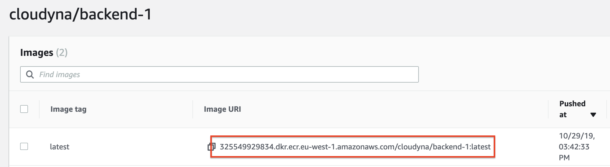

  
  
  

# Deploying to Fargate

## LAB Overview

#### In this lab you will deploy the application to your ECS cluster using Fargate.

## Task 1: Preparing security groups.
In this task you will prepare security groups for your load balancer and ECS instances. You can operate on **default** VPC.

1. In the AWS Management Console, on the **Services** menu, click **VPC**.
2. On the left pane click **Security groups**.
3. Click **Create security group**.
4. Set **Security group name** to *student-X-prod-alb-sg*.
5. Set **Description** to *Student X ALB security group*.
6. Select your VPC id (default vpc is fine). Ask instructor for help if you can't find it.
7. Click **Create**.
8. Click **Close**.
9. Select the security group you've just created.
10. Select **Inbound rules**.
11. Click **Edit rules**.
12. Click **Add rule**.
    * Type: **Custom TCP**
    * Protocol: **TCP**
    * Set **Port range** to *80*.
    * Set **Source** to *0.0.0.0/0, ::/0*.
13. Click **Save rules**.
14. Click **Close**.
15. Click **Create security group**.
16. Set **Security group name** to *student-X-prod-ecs-sg*.
17. Set **Description** to *Student X ECS security group*.
18. Select your VPC id (use the same VPC as moment before).
19. Click **Create**.
20. Click **Close**.
21. Select the security group you've jus created.
22. Select **Inbound rules**.
23. Click **Edit rules**.
24. Click **Add rule**.
    * Type: **All TCP**
    * Source: **Custom** and select security group for your Application Load Balancer.
25. Click **Save rules**.
26. Click **Close**.

## Task 2: Creating a load balancer for your services

1. In the AWS Management Console, on the **Services** menu, click **EC2**.
2. On the left panel click **Load balancers**.
3. Click **Create Load Balancer**.
4. Select **Application Load Balancers** and click **Create**.
5. Enter a name for your load balancer: *student-X-ALB*.
6. In the **Availability Zones** section:
   * Select the same VPC just like moment before.
   * Select at least two availability zones and subnets
7. Click **Next: Configure Security Settings**.
8. Click **Next: Configure Security Groups**.
9.  Choose **Select an existing security group**.
10. Select the security group you created for your load balancer (e.g. student-1-prod-alb-sg).
11. Click **Next: Configure Routing**.
12. Select *New target group* as **Target group**.
13. Enter a name for your target group, "student-X-tg1".
14. Leave the rest configuration in default.
15. Click **Next: Register Targets**.

Do not add any targets! Skip for now and move forward.

15. Click **Next: Review**.
16. Click **Create**.
17. Click **Close**.
18. Select your loadbalancer.
19. From Description tab copy **DNS name** into notepad.

## Task 3. Preparing Task Definition for backend service

In this task you will prepare a task definition for backend service.

1. In the AWS Management Console, on the **Services** menu, click **ECS**.
2. On the left pane select **Task definitions**.
3. Click **Create new Task Definition**.
4. Select **Fargate** and click **Next step**.
5. Enter a **Task Definition Name**, *student-X-backend-definition*.
6. Set **Task memory** to *0.5GB*.
7. Set **Task CPU** to *0.25 vPCU*.
8. Click **Add container**.
9. Enter a **Container name**, *student-X-backend-container*.
10. Set **Image** to the uri of your backend image. You copied it into notepad, or you can find it in the ECR repository.

11. Select **Hard Limit** for **Memory Limits** and set it to *256*.
12. Set **Port mappings** as:
    * **Container port**: 80.
13. Scroll down and make sure a **Auto-configure CloudWatch Logs** option is checked.
14. Scroll down and click **Add**.
15. Leave the rest unchanged, click **Create** and **View task definition**.

## Task 4. Preparing Task Definition for frontend service

In this task you will prepare a task definition for one of microservices.

1. Click **Create new Task Definition**.
2. Select **Fargate** and click **Next step**.
3. Enter a **Task Definition Name**, *student-X-frontend-definition*.
4. Set **Task memory** to *0.5GB*.
5. Set **Task CPU** to *0.25 vPCU*.
6. Click **Add container**.
7. Enter a **Container name**, *student-x-frontend-container*.
8. Set **Image** to the uri of your frontend image. 
9. Select **Hard Limit** for **Memory Limits** and set it to *256*.
10. Set **Port mappings** as:
    * **Container port**: 80.
11. Scroll down and click checkmark the **Auto-configure CloudWatch Logs** option.
12. Scroll down and click **Add**.
13. Leave the rest unchanged, click **Create** and **View task definition**.

## Task 5: Creating ECS cluster & backend service

In this task you will add two ECS services.

1. In the AWS Management Console, on the **Services** menu, click **ECS**.
2. Click **Clusters**.
3. Click **Create Cluster**.
4. Select **Networking only** (Powered  by AWS Fargate) anc click **Next step**.
5. Enter a **Cluster name**, e.g. student-X-cluster.
6. Leave **Create VPC** unchecked.
7. Click **Create**. 
8. Click **View Cluster**.
9. Select **Services** tab below.
10. Click **Create**.
11. Set **Launch type** to *Fargate*.
12. Set your backend task definition as **Task Definition**.
13. Select the latest revision.
14. Set **Service name** to *student-X-backend*.
15. Set **Service type** to *Replica*.
16. Set **Number of tasks** to 1.
17. Click **Next step**.
18. Set **Cluster VPC** to your VPC.
19. Add your subnets.
20. Right to the **Security groups** click **Edit**.
21. Select **Select existing security group**.
22. Select the security group you prepared for your ECS Cluster.
23. Click **Save**.
24. Set **Health check grace period** to 10.
25. Set **Load balancer type** to **Application Load Balancer**.
26. Set the load balancer you created in task 2 as **Load balancer name**.
27. Select your container and port as **Container name : port** and click **Add to load balancer**.
28. Select **HTTP:80** as **Production listener port**.
29. Select **Create new** as **Target group name** and set its name to *student-x-back-tg*.
30. Set **Path pattern** to */api* * and set **Evaluation order** to *1*.
31. Set **Health check path** to */api/health*
32. Turn off **Service discovery** by unchecking **Enable service discovery integration** option.
33. Click **Next step**.
34. Select **Do not adjust the service’s desired count** and click **Next step**.
35. Click **Create service**.
36. Click **View service**.

Now you have your first service configured.
## Task 6: Creating frontend service

37. Click **Clusters**.
38. Find your cluster and click on it's name.
39. Select **Services** anc click **Create**.
40. Set **Launch type** to *Fargate*.
12. Set your frontend task definition as **Task Definition**.
13. Select the latest revision.
14. Set **Service name** to *student-X-frontend*.
15. Set **Service type** to *Replica*.
16. Set **Number of tasks** to 1.
17. Click **Next step**.
18. Set **Cluster VPC** to your VPC.
19. Add your subnets.
20. Right to the **Security groups** click **Edit**.
21. Select **Select existing security group**.
22. Select the security group you prepared for your ECS Cluster.
23. Click **Save**.
24. Set **Health check grace period** to 10.
25. Set **Load balancer type** to **Application Load Balancer**.
26. Set the load balancer you created in task 2 as **Load balancer name**.
27. Select your container and port as **Container name : port** and click **Add to load balancer**.
28. Select **HTTP:80** as **Production listener port**.
29. Select **Create new** as **Target group name** and set its name to *student-x-front-tg*.
30. Set **Path pattern** to */* * and set **Evaluation order** to *2*.
31. Set **Health check path** to */*.
32. Turn off **Service discovery** by unchecking **Enable service discovery integration** option.
33. Click **Next step**.
34. Select **Do not adjust the service’s desired count** and click **Next step**.
35. Click **Create service**.
36. Click **View service**.

## END LAB

  

&copy; 2019 Chmurowisko Sp. z o.o.

