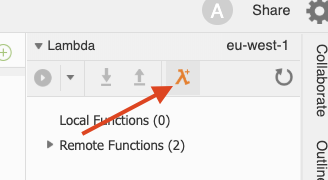
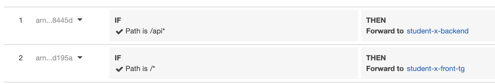
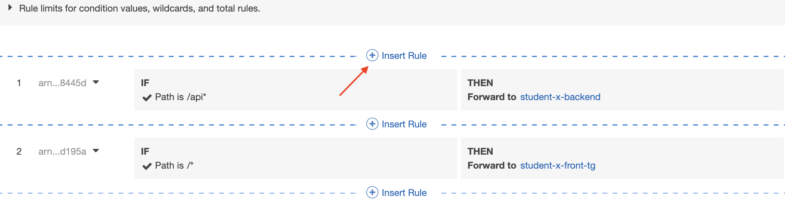

<br><br>
<br><br>
<br><br>

# Lambda

## LAB Overview

#### During this Lab you will move all **GET** operations to a Lambda function.

## Task 1: Creating Lambda function

In this task you will create Lambda function.

1. In your Cloud9 environment, on the right side click **Create a new Lambda function** button

2. Enter a **Function name** and click **Next**.
3. Set **Python 3.6** as selected runtime.
4. Choose **empty-python** and click **Next**.
5. Set **none** as **Function trigger** and click **Next**.
6. Set **Memory** to 256MB and leave **Automatically generete role** unchanged.
7. Click **Next**.
8. Click **Finish**.


## Task 2: Adding permissions to Lambda role
1. Open *template.yaml* file in navigation panel.
2. Add following line to *Properties*:
```
Policies: AmazonDynamoDBFullAccess
```
and save the file

## Task 3: Creating function code
3. Open *lambda_function.py* file in the Cloud 9 editor.
4. Download [Lambda handler file](./files/lambda/lambda_function.py) and paste its content into the editor window. 

5. Still in the Cloud 9, create new file and paste contents of [Manager file](./files/lambda/manager.py) into the editor.
6. Edit DynamoDB table name.
7. Save the file.
8. Right click on your Lambda name and click **Deploy**.

## Task 4: Creating a target group for Load Balancer

1. In the AWS Management Console, on the **Services** menu, click **Lambda**.
2. Find your function and click on its name. you can examine and discuss all settings. Ask leader if anything is unclear.
3. In the AWS Management Console, on the **Services** menu, click **EC2**. Dont' be affraid, we'll not set up any VMs ;-)
4. Scroll down rhe left pane and click **Tagret Groups**.
5. Click **Create target group**.
6. Enter a **Target group name**.
7. Set **Target type** to **Lambda function**.
8. Choose the function you creates in revious task as **Lambda function**.
9. Leave the rest unchanged and click **Create**.
10. Click **Close**.

## Task 5:Adding target group to the Load Balancer

1. On the left pane click **Load Balancers**.
2. Find your load balancer and select it.
3. Select **Listeners**.
4. Click **View/edit rules**.
there should be at lease two rules:

5. Click **+** button.
6. Click first **+ Insert Rule** button.

7. Click **Add condition** button.
8. Select **Http request method**.
9. Set the value to **GET**.
10. Approve changes by clickint the checkmark button.
11. Click **Add condition** button once again.
12. Select **Path**.
13. Set value to **/api/Ticket***
14. Approve changes by clickint the checkmark button.
15. Click **Add action**.
16. Select **Forwart to**.
17. Select the target group you created in previous task.
18. Approve changes by clickint the checkmark button.
19. Click **Save**.

Now, all GET oprations are using Lambda function.

## END LAB

<br><br>

<center><p>&copy; 2019 Chmurowisko Sp. z o.o.<p></center>