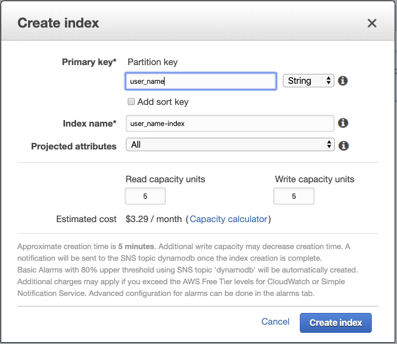
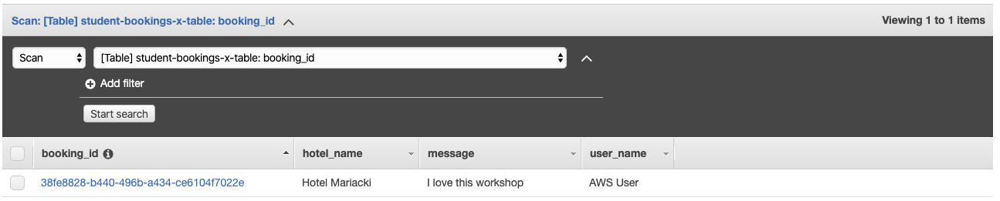

# Saving data directly to DynamoDB table using API Gateway as a proxy and fanning out

## LAB Overview

#### This lab will demonstrate:
 * How to save your data to DynamoDB table directly. No Lambdas involved.
 * How to stream DynamoDB changes
 * How to fan out the application

## Task 1: Adding DynamoDB table.

In this task you will create DynamoDB table.

1. In the AWS Management Console, on the **Services** menu, click **DynamoDB**.
2. Click **Create table**.
3. Enter a name for your table, e.g. "student-bookings-x-table".
4. Name your *Primary key* as "booking_id" and set the type to "String".
5. Uncheck **Use default settings**.
6. Turn off "Auto scaling" by unchecking **Read capacity** and **Write capacity**.
7. Click **Create**.

After your table is populated...

8. Click **Indexes** and **Create index**.
9. Enter a name for the **Partition key**, e.g. "user_name".



10. Leave the rest unchanged and click **Create index**.


## Task 2. Creating role for API Gateway.

In this tak you will prepare a role for API Gateway. You need to add permissions to access DynamoDB.
1. In the AWS Management Console, on the **Services** menu, click **IAM**.
2. Click **Roles**.
3. Click **Create role**.
4. Select **API Gateway** as a service.
5. Click **Next: Permissions**.
6. Click **Next: Tags** and **Next: Review**.
7. Enter a name for the role, e.g. "apigateway-dynamodb-role" and click **Create role**.
8. Find your role and click on its name.
9. Click **Attach policies**.
10. Find "AmazonDynamoDBFullAccess" policy and add it to the role.
11. Save the ARN of the role.

## Task 3: Creating API using API Gateway

In this task you will create API using API Gateway and connect it to Lambda function as a proxy.

1. In the AWS Management Console, on the **Services** menu click **API Gateway**.
2. Click **Get started** and **OK**.
3. Select **REST** as a protocol.
4. Select **New API**.
5. Enter a name for yor API, e.g. "BookingApi".
6. Select **Regional** as an endpoit type.
7. Click **Create API**.
8. Click **Actions** and select **Create resource**.
9. Enter an name for the resurce, e.g. "booking".
10. Check **Enable API Gateway CORS**.
11. Click **Create Resource**.
12. Select your new resource, click **Actions** and select **Create Method**.
13. Expand the method drop-down, select **POST**, and then choose the check mark icon to save the choice.
14. Select **AWS Service** as the **Integration type**.
15. Expand the **AWS Region** drop-down, select your region.
16. Expand the **AWS Service** drop-down, select **DynamoDB**.
17. Set **HTTP method** to **POST**.
18. Leave **Action Type** as **Use action name**.
19. Type *PutItem* into **Action**.
20. Enter the ARN of the role you created in the previous step.
21. Click **Save**.

## Task 4. Creating mapping templates.

In this task you will create a mapping template for your POST request.

1. Select your **POST** method.
2. From the **Method Execution screen**, choose **Integration Request**.
3. Expand the **Mapping Templates** section.
4. Choose **Add mapping template**. 
5. Select **When there are no templates defined (recommended)** for **Request body passthrough**.
6. Under **Content-Type**, type "application/json" and then choose the check mark to save changes. 
7. Click **No, use current settings**.  
8. Download [post_mapping_template.json](./files/post_mapping_template.json), copy its content and paste it into template field.
9. Type your DynamoDb table name instead of "YOUR TABLE NAME".
10. Click **Save**.
11. Click **Actions** and select **Deploy API**.
12. Select **New Stage** as **Deployment stage**.
13. Enter a **Stage name**
14. Click **Deploy**.

## Task 5. Testing the solution.

In this task you will test if your data is saved to DynamoDB table. You'll need a POST request with a payload shown below:

```
{
  "hotelName": "Hotel Mariacki",
  "userName": "AWS User",
  "message":  "I love this workshop"
}
```

1. Use your preffered tool and send POST request to your new api.

Below you have a sample *curl* command.

```
curl -X POST \
  https://<URL OF YOUR API>/<STAGE>/booking \
  -H 'Content-Type: application/json' \
  -H 'cache-control: no-cache' \
  -d '{
  "hotelName": "Hotel Mariacki",
  "userName": "AWS User",
  "message":  "I love this workshop"
}'
```

2. Open your DynamoDB table.
3. Click **Items**.
4. Look for your saved item.


# Task 6. Creating queues

In this task you will create 4 SQS queues.

1. In the AWS Management Console, on the **Services** menu click **SQS**.
2. Click **Create New Queue**.
3. Select **Standard Queue**.
4. Enter a name for the queue: *dynamo-db-arrivals-queue*.
5. Click **Configure Queue** and look into parameters. Do not change anything and click **Create Queue**.
6. Click **Create New Queue**.
7. Select **Standard Queue**.
8. Enter a name for the queue: *payments-queue-dlq*.
9. Click **Quick Create Queue**.
10. Click **Create New Queue**.
11. Select **Standard Queue**.
12. Enter a name for the queue: *payments-queue*.
13. Click **Configure Queue**.
14. Check the checkmark for **Use Redrive Policy**.
15. Enter the name of the previous queue as **Dead Letter Queue**.
16. Set **Maximum Receives** to 2.
17. Click **Create Queue**.
18. Click **Create New Queue**.
19. Select **Standard Queue**.
20. Enter a name for the queue: *check-hotel-queue*.
21. Click **Quick-Create Queue**.

## Task 7: Creating Lambda consuming DynamoDB changes

In this task you will add a stream to your DynamoDB table and will consume table changes using Lambda function.

1. In the AWS Management Console, on the **Services** menu, click **Lambda**.
2. Click **Create function**..
3. Select **Blueprints**.
4. Type *dynamodb* into **Search box** and press **Enter**.
5. Select *dynamodb-process-stream-python3* blueprint.
6. Click **Configure**.
7. Enter a name for your Lambda function, e.g. "consume-stream-lambda".
8. Choose **Create a new role from AWS policy templates** as a **Role**.
9. Enter a name for the role, e.g. "consume-stream-lambda-role".
10. Select your DynamoDB table as **DynamoDB table**.
11. Set **Batch size** to 10.
12. Scroll down and check **Enable trigger** checkmark.
13. Set **Starting position** to **Trim horizon**.
14. Click **Create function**.

You will get an error, that you can not access the stream, don't worry.

Now, you need to assign permissions to your Lambda function.

15. In the AWS Management Console, on the **Services** menu, click **IAM**.
16. Click **Roles**.
17. Find "consume-stream-lambda-role" role and click on its name.
18. Click **Attach policies**.
19. Find *AWSLambdaInvocation-DynamoDB* policy and check the checkmark left to the policy name.
20. Click **Attach policy**.
21. Click **Attach policies**.
22. Find *AmazonSQSFullAccess* policy and check the checkmark left to the policy name.
23. Click **Attach policy**.
24. Click **Attach policies**.
25. Find *AmazonSNSFullAccess* policy and check the checkmark left to the policy name.
26. Click **Attach policy**.
27. In the AWS Management Console, on the **Services** menu, click **DynamoDB**.
28. Click **Tables**, find your table and click on its name.
29. Click on **Triggers** tab.
30. Click **Create trigger** and select **Existing Lambda function**.
31. In the dropdown menu, select the function you created in the previuos step.
32. Set batch size to 10.
33. Click **Create**.

34. Use your preffered tool and send POST request to your api.

Below you have a sample *curl* command.

```
curl -X POST \
  https://<URL OF YOUR API>/<STAGE>/booking \
  -H 'Content-Type: application/json' \
  -H 'cache-control: no-cache' \
  -d '{
  "hotelName": "Hotel Mariacki 2",
  "userName": "AWS User",
  "message":  "DynamoDB stream test"
}'
```

35. Open your "consume-stream-lambda" function.
36. Click **Monitoring** and **View logs in CloudWatch**.

In the CloudWatch log you can see that changes made to your DynamoDB table now invokes "consume-stream-lambda" Lambda function. You can use it in many ways. 

37. Go to your Lambda edit screen.
38. Download [source file](./files/dynamodb_stream_lambda.py) and replac current source code with its contents.
39. Click **Save**.
40. Use your preffered tool and send POST request to your api.

Below you have a sample *curl* command.

```
curl -X POST \
  https://<URL OF YOUR API>/<STAGE>/booking \
  -H 'Content-Type: application/json' \
  -H 'cache-control: no-cache' \
  -d '{
  "hotelName": "hotel name",
  "userName": "AWS User",
  "message":  "SQS test"
}'
```
41. In the AWS Management Console, on the **Services** menu, click **SQS**.
42. Find your **dynamo-db-arrivals-queue**. There should be a message inside it. Select the queue, click **Queue Actions** and select **View/Delete Messages**.
43. Click **Start Polling for Messages**. Look into messages.
44. Select a message and click **Delete Messages**.
45. Click **Yes, Delete Selected Messages**.
46. Click **Stop Now** or **Close**.


## Task 8. Creating SNS topic and fanning out.

1. In the AWS Management Console, on the **Services** menu, click **SNS**.
2. Click **Topics**.
3. Click **Create topic**.
4. Enter a name.
5. Click **Create topic**.
6. In the AWS Management Console, on the **Services** menu, click **SQS**.
7. Find your payment queue, select it, click **Queue Actions** and select **Subscribe Queue to SNS Topic**.
8. Select your SNS topic and click **Subscribe**.
9. Find your check hotel queue, select it, click **Queue Actions** and select **Subscribe Queue to SNS Topic**.
10. Select your SNS topic and click **Subscribe**.

Now, you'll change the Lambda function. You will also post a message to the SNS topic and the message will be delivered to next two queues. 

11. Go back to your Lambda editor.
12. Download [source file](./files/dynamodb_stream_lambda2.py) and replace current source code with its contents.
13. Edit queue name and topic arn variables.
14. Click **Save**.

15. Use your preffered tool and send POST request to your api.

Below you have a sample *curl* command.

```
curl -X POST \
  https://<URL OF YOUR API>/<STAGE>/booking \
  -H 'Content-Type: application/json' \
  -H 'cache-control: no-cache' \
  -d '{
  "hotelName": "hotel name",
  "userName": "AWS User",
  "message":  "SNS test"
}'
```

Check your queues. Now you should have messages in all three queues.

## Task 9: Pulling messages from SQS queue.

1. In the AWS Management Console, on the **Services** menu, click **Lambda**.
2. Click **Create function**.
3. Enter a name *payments-lambda*.
4. Set **Python 3.7** as a **Runtime**.
5. Click **Create function**.
6. Download [source file](./files/payment_lambda.py) and paste its content into the editor as Lambda source code.
7. Click **Save**.88 and click on role name.
8. Scroll down to **Execution role.
9. Click **Attach policies**.
10. Find **AmazonSQSFullAccess** policy attach it to the fole and click **Attach policy**.
11. In the AWS Management Console, on the **Services** menu, click **SQS**.
12. Select your *payments-queue*, click **Queue Actions** and select **Configure Trigger for Lambda Function**.
13. Select a Lambda function you created in thi task and click **Save**.
14. Click **OK**.

You can look into the Lambda settings. SQS should be added as a function trigger.

15. Use your preffered tool and send POST request to your api.

Below you have a sample *curl* command.

```
curl -X POST \
  https://<URL OF YOUR API>/<STAGE>/booking \
  -H 'Content-Type: application/json' \
  -H 'cache-control: no-cache' \
  -d '{
  "hotelName": "hotel name",
  "userName": "AWS User",
  "message":  "SQS to Lambda test"
}'
```

16. Open your *payment-lambda* function.
17. Click **Monitoring** and **View logs in CloudWatch**.

In the CloudWatch log you can see that the function processed a message sent by the process.

18. Open your queues. As you can see, there is no message in the *payments-queue*. It was "consumed" by the Lambda.
19. Open the *payments-lambda* code.
20. Uncomment line **#x = 2 / 0**.
21. Sent the POST request once again.
22. Wait 2 minutes and look into your queues. Now, the message should be moved do dead letter queue.


## END LAB

<br><br>