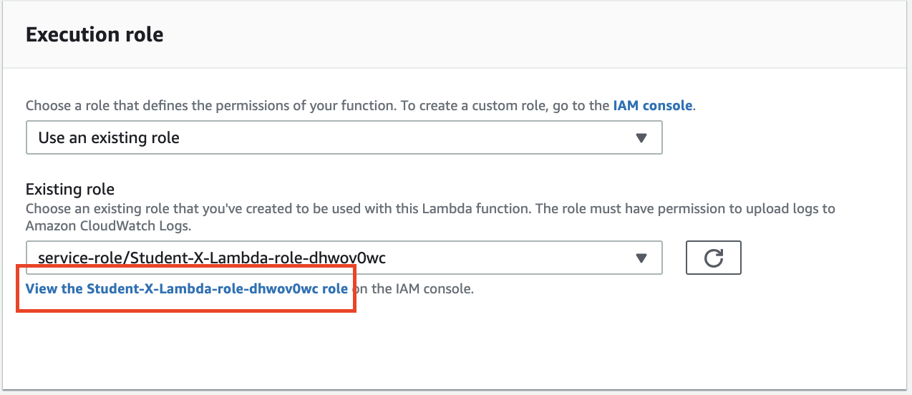

  
  
  

# AWS Lambda + S3 + SNS

## LAB Overview

#### This lab lets you build a serverless solution which uses AWS Lambda triggered by S3 bucket and simple Notification Service 

#### This lab will demonstrate:
* Creating S3 bucket
* Creating AWS Lambda function and connecting it to S3 bucket

## Task 1: Creating S3 bucket
In this task you will create private S3 bucket

1. In the AWS Management Console, on the **Services** menu, click **S3**.
2. Click **Create bucket**.
3. Enter a bucket name, e.g. "student-X-sns-bucket".
4. Click **Create** on the left.

## Task 2: Create a simple Lambda function

In this task you will create simple Lambda function and will look into event object.

5. In the AWS Management Console, on the **Services** menu, click **Lambda**.
6. Click **Create function**.
7. Insert a name for your function e.g "Student-X-sns-Lambda".
8. Select "Python 3.6" as a runtime.
9. In **Permissions** unwind **Choose or create an execution role** and Select "Create a new role with basic Lambda permissions" in the Role menu.
10. Click **Create function** .
11. Download **[simple\_lambda.py](simple_lambda.py)** file and paste the file content into lambda function editor.
12. Click **Save** button.
13. Click **Test** button.
14. Select "Amazon S3 Put" as **Event template**.
15. Enter a name for "Event name", e.g. "Testevent".
16. Click **Create** button.
17. Click **Test** button.
18. Go to the top of the page and click **Monitoring**.
19. Click **View logs in CloudWatch**.
20. Click on the latest log stream.
21. Look into lambda execution details. Take a look at test data passed to Lambda function as an event. Find bucket and object name.

## Task 3: Configuring S3 events as Lambda trigger

In this task you will connect your S3 bucket events to your Lambda function. Putting any object into S3 bucket will trigger the Lambda.

22. In the AWS Management Console, on the **Services** menu, click **Lambda**.
23. Find your Lambda function and click on its name.
24. In the **Designer** area select "S3" as a trigger.
25. Scroll down and select your bucket as **Bucket**.
26. Select "All object create events" as **Event type**.
27. Mark **Enable trigger** as checked.
28. Click **Add**.
29. Click **Save**.
30. In the AWS Management Console, on the **Services** menu, click **S3**.
31. Find your bucket and click on its name.
32. Click **Upload**.
33. Click **Add files**.
34. Select any file and click **Upload**.
35. Go back to your Lambda function.
36. Go to the top of the page and click **Monitoring**.
37. Click **View logs in CloudWatch**.
38. Click on the latest log stream.
39. Look into lambda execution details. Take a look at test data passed to Lambda function as an event. Find bucket and object name.

## Task 4: Editing Lambda code. Generating signed URLs and sending SMS using SNS.

In this task you will edit existing Lambda code. Lambda will generate signed url for every uploaded file and send SMS using Simple Notification Service.

40. In the AWS Management Console, on the **Services** menu, click **Lambda**.
41. Find your Lambda function and click on its name.
42. Download **[lambda.py](lambda.py)** file and paste the file content into lambda function editor.
43. Scroll down and insert two environment variables:
* phone_number - number of the phone SNS will send messages to eg. +48111111111
* sender_id - self explanatory variable ;-) (between 1 and 11 chars)
44. Click **Save**.
45. Click **View the \<your role name\>** link.

46. Click **Add inline policy**.
47. Click **Choose a service**.
48. Click **SNS**.
49. Unwind **Write** actions.
50. Select **Publish**.
51. As **Resources** select **All resources**.
52. Click **Add additional permissions**.
53. Click **Choose a service**.
54. Click **S3**.
55. Unwind **Read** actions.
56. Select **GetObject**.
57. Unwind **Resources**.
58. Check **All resources**.
59. Click **Review policy**.
60. Enter a name for your policy.
61. Click **Create policy**.

## Task 5: Testing the solution

In this task you will test if everything is ok. After uoploading any file to your S3 bucket you should get a message with a signed url to your file.

62. In the AWS Management Console, on the **Services** menu, click **S3**.
63. Find your bucket and click on its name.
64. Click **Upload**.
65. Click **Add files**.
66. Select any file and click **Upload**.

You should get a message in a moment. If anything goes wrong look into **Cloud watch** logs.

## END LAB

  

&copy; 2019 Chmurowisko Sp. z o.o.

